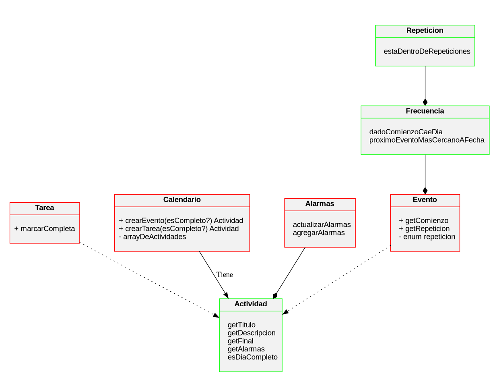

# TP Calendario

Alumnos:

- Gerez Facundo Nahuel - 109429
- Orsi Tomas Fabrizio - 109735

CUIDADO:

ESTAN ENTRANDO A UN REPOSITORIO DE JAVA. DONDE TODO ES UN OBJETO Y LAS FUNCIONES NO EXISTEN.
LA TIERRA DE LOS ESTADOS Y DE LAS CANTIDADES INNUMERABLES DE ARCHIVOS.
DONDE ES NECESARIO DE MAGIA Y RITUALES PARA PODER COMPILAR UN SALUDO AL MUNDO.
PERO, EN ESTA TIERRAS MALDITAS, DOS HEROES SE ANTEPODRAN ANTE LAS ADVERSIDADES
PARA ... programar un calendario. 

(Esto esta desactualizado)

